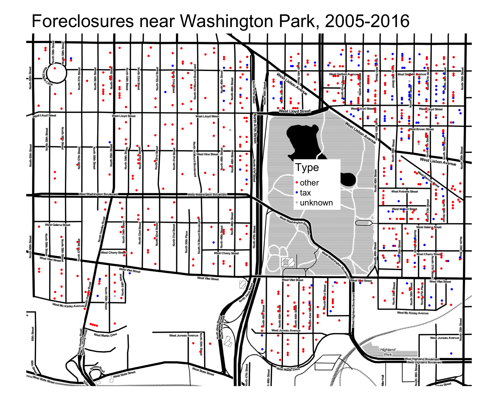
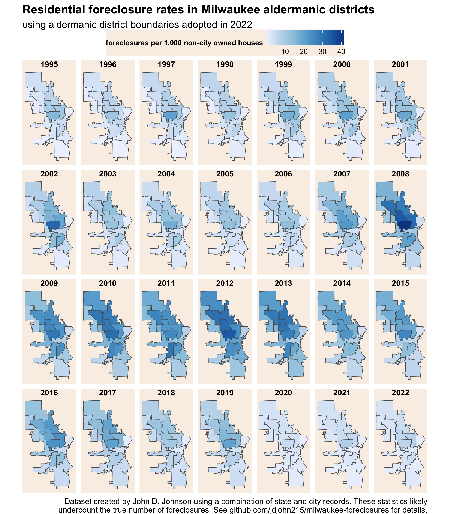

# Foreclosures in Milwaukee

Although the massive wave of foreclosures during and following the 2008 Housing Crisis is well known, specific data on the numbers and locations of foreclosures are hard to find. This repository includes a custom dataset of geocoded, parcel-level foreclosure data covering residential properties in the City of Milwaukee during the years 1995 through 2022.

See the README in `source-data` directory for details about data sources, coverage, and fields.

This data could be used in a variety of ways including studying parcel-level effects on properties that experienced foreclosures.

For instance, the map below shows where each kind of foreclosure took place during 2005-2016 in the neighborhoods surrounding Washington Park. Future research could compare change in owner occupancy or home values between foreclosed and non-foreclosed houses on the same block. The foreclosure dataset includes the name of the grantee in each conveyance. Among other possibilities, this allows us to distinguish between city tax foreclosures and other kinds of foreclosures (i.e. mortgage-related).

Data can also be aggregated into any desired geography. In the `processed-data` directory I provide pre-tabulated files of foreclosures by census tract, aldermanic district, and city neighborhood. The next image shows the annual rate of foreclosures in each Milwaukee aldermanic district for the past 27 years.

Data can also be aggregated across time. The next map shows the neighborhood cumulative foreclosure rate from 2007 to 2016. In other words, it shows the percent of unique houses in a neighborhood which experienced at least one foreclosure during that decade. The table shows the top 10 neighborhoods by this metric. More than 3-in-10 houses underwent at least foreclosure in Sherman Park, Washington Park, Maple Tree, and Silver Swan.

**Cumulative foreclosure rates form 2007-2016, top 10 neighborhoods**

|   neighborhood      | houses    | foreclosure_share |
|---------------------|-----------|-------------------|
|  Silver Swan        |   398     |  34.9%            |
|  Maple Tree         |   387     |  33.6%            |
|  Washington Park    |   1,021   |  31.4%            |
|  Sherman Park       |   1,658   |  30.6%            |
|  Uptown             |   1,420   |  29.2%            |
|  Saint Joseph       |   1,633   |  27.6%            |
|  Cold Spring Park   |   283     |  27.2%            |
|  Metcalfe Park      |   599     |  26.9%            |
|  Old North Milwaukee|   3,097   |  26.5%            |
|  Silver Spring      |   2,475   |  26.1%            |